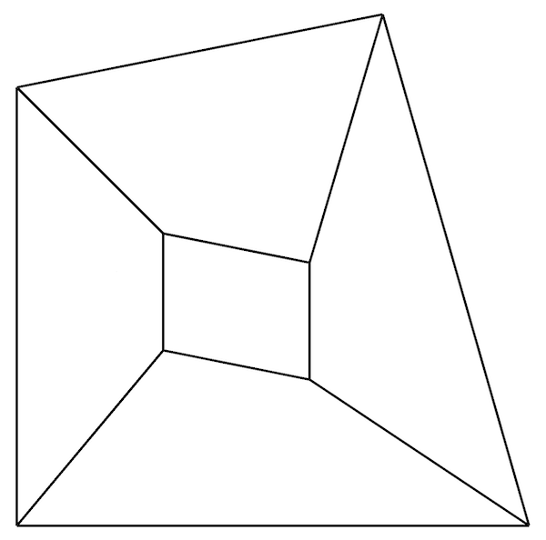
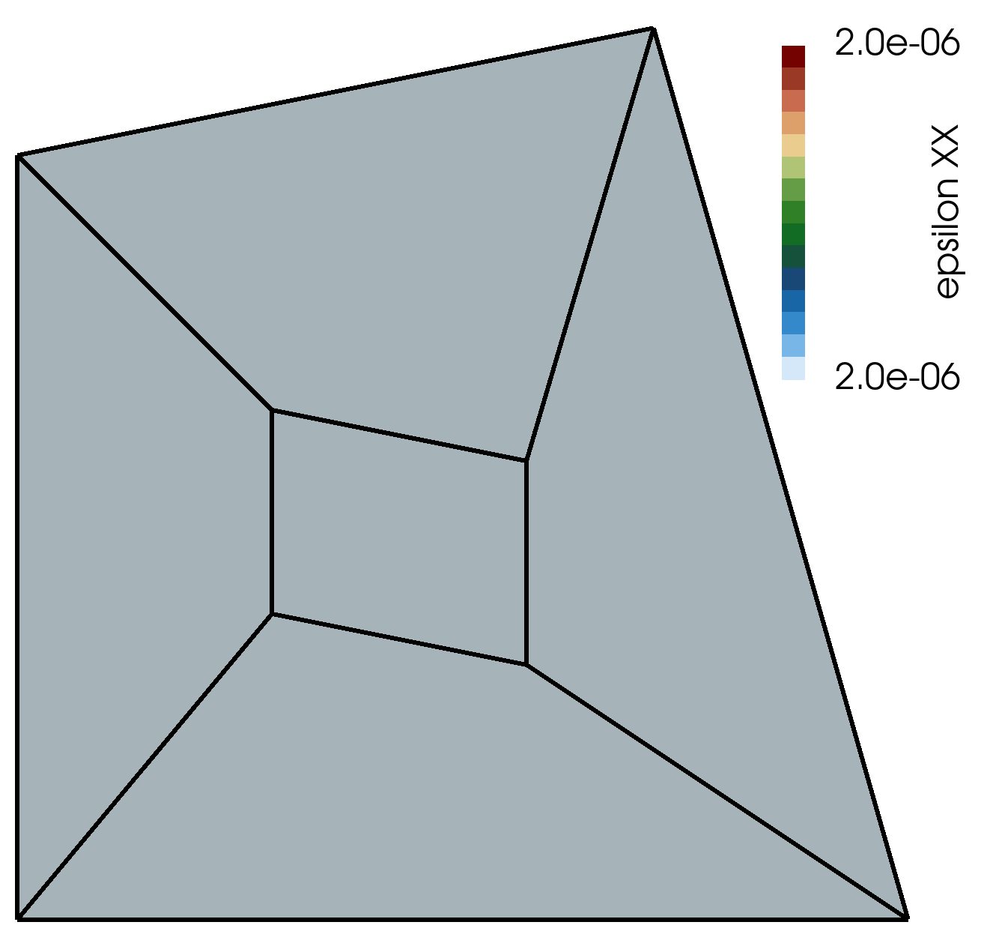

# `patchTest`

---

## Tutorial Aims

- Demonstrate the standard *patch test*, which is commonly used to test finite element formulations.


## Case Overview

The patch test checks the ability of the discretisation to reproduce polynomials of a specified order, known as *polynomial completeness* of the displacement field. For example, if a local linear displacement field is assumed when deriving a discretisation, then this discretisation should produce zero discretisation (mesh) errors on cases where the true displacement solution is linear. For further details, see [T Belytschko, WK Liu, B Moran, K Elkhodary, Nonlinear finite elements for continua and structures, 2014, Wiley, 2nd Edition](https://www.wiley.com/en-br/Nonlinear+Finite+Elements+for+Continua+and+Structures,+2nd+Edition-p-9781118632703).

The case geometry (Figure 1) consists of an irregular quadrilateral, which is meshed using five irregular quadrilateral cells. It is important that distorted cells are used, as orthogonal cells may satisfy the patch test when arbitrary quadrilaterals do not.



**Figure 1: Standard patch test geometry and mesh**

Uniform, linear elastic material properties are assumed; in this case, Young's modulus of 200 GPa and Poisson's ratio of 0.3. Body forces are set to zero. In this case, where we are examining spatially second-order solid solvers, a linearly-varying displacement field is prescribed for the four boundary patches:

$$
d_x = \alpha_{x0} +  \alpha_{x1}x +  \alpha_{x2}y, \quad d_y = \alpha_{y0} +  \alpha_{y1}x +  \alpha_{y2}y
$$

Where $$d_x$$ is the x-component of displacement, $$d_y$$ is the y-component, $$x$$ is the x-coordinate, $$y$$ is the y-coordinate, and the constant $$\alpha$$ are set by the user. In this case,  $$\alpha_{x0} = 1e-6$$, $$\alpha_{x1} = 2e-6$$, $$\alpha_{x2} = 3e-6$$, $$\alpha_{y0} = 4e-6$$, $$\alpha_{y1} = 5e-6$$, and $$\alpha_{y2} = 6e-6$$.

For the discretisation to pass the patch test, the strains (`epsilon`) should be constant in the domain and given by

$$
\epsilon_{xx} = \frac{\partial d_x}{\partial x} = \alpha_{x1}, \quad
\epsilon_{yy} = \frac{\partial d_y}{\partial y} = \alpha_{y2}, \quad
\epsilon_{xy} = \epsilon_{yx}= \frac{1}{2} \left(\frac{\partial d_x}{\partial y} + \frac{\partial d_y}{\partial x} \right) = \frac{1}{2} \left( \alpha_{x2} + \alpha_{y1}\right)
$$

The stresses should also be constant in the domain.

```note
If higher-order discretisations were to be tested, higher-order displacement conditions would be applied.
```

The patch test is not specific to solid mechanics, and, in fact, it can be used to test the polynomial completeness of any numerical discretisation. In OpenFOAM/foam, achieving polynomial completeness on irregular meshes requires that boundary patch non-orthogonal corrections are enabled. One way to achieve this is through custom boundary conditions, as used in solids4foam. In particular, the `evalaute` and `snGrad` functions should be updated. Polynomial completeness is related to the order of accuracy that can be achieved in irregular meshes; for example, without these boundary-patch non-orthogonal corrections, standard OpenFOAM/foam solvers will reduce from second to first-order accuracy when boundary cells are non-orthogonal.


---

## Running the Case

The tutorial case is located at `solids4foam/tutorials/solids/linearElasticity/patchTest`. The case can be run using the included `Allrun` script, i.e. `./Allrun`. In this case, the Allrun simply consists of creating the mesh using blockMesh (`./blockMesh`) followed by running the solids4foam solver (`./solids4Foam`).

```warning
For OpenFOAM.com and OpenFOAM.org, the `pointCellsLeastSquares` or `edgeCellsLeastSquares` gradient schemes should be used for calculating the gradient of displacement; these are the only gradient schemes available in these versions, which are consistent with the required boundary non-orthogonal corrections.
```

---

## Expected Results

As noted above, the strain tensor should be constant in the domain and, for the chosen $$\alpha$$ paramters, equal to:

$$
\epsilon_{xx} = \alpha_{x1} = 2e-6, \quad
\epsilon_{yy} = \alpha_{y2} = 6e-6, \quad
\epsilon_{xy} = \frac{1}{2} \left( \alpha_{x2} + \alpha_{y1}\right) = 4e-6
$$

The constant xx-component of strain field (`epsilon[XX]`) is shown in Figure 2.



**Figure 2: Constant xx-component of the strain field ($$\epsilon_{xx}$$, `epsilon[XX]`) in the patch test**
